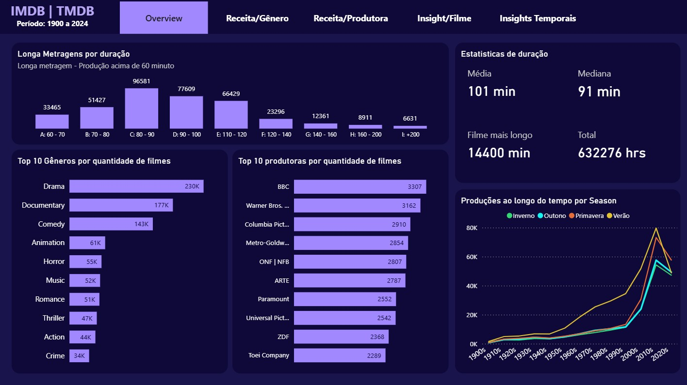
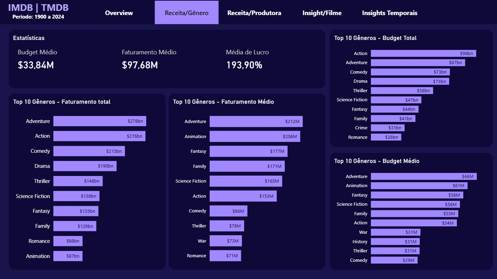
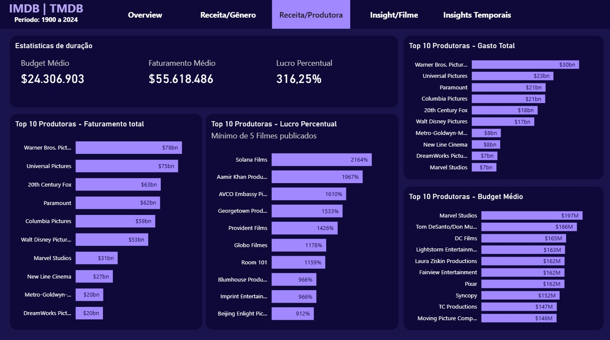
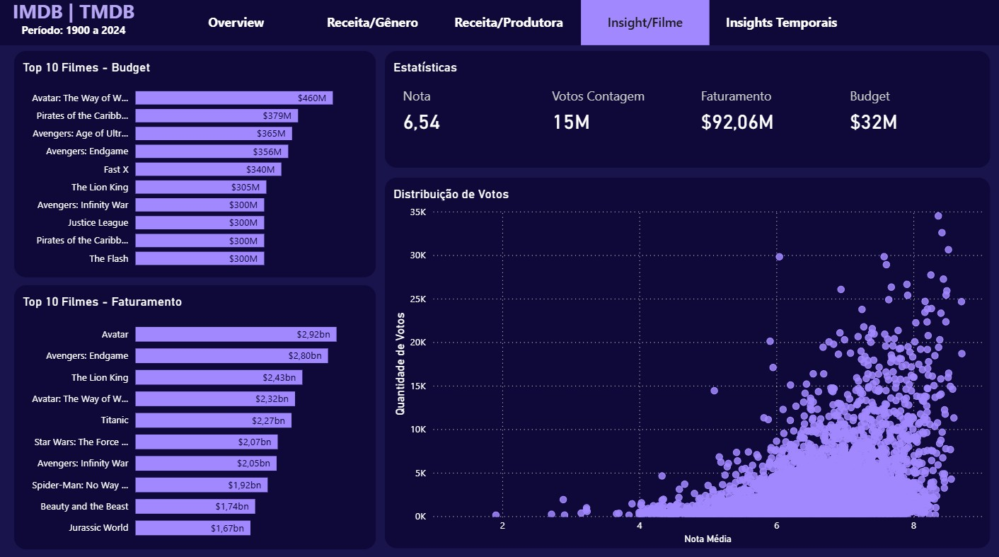
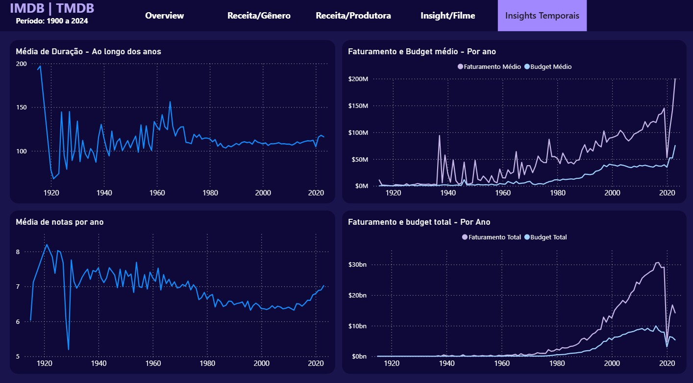

# 📊 Projeto: Análise exploratória dos Filmes - TMDB Dataset

## Sobre o Projeto

Esse projeto tem como objetivo tratar e analisar dados de filmes principalmente do TMB para entender as tendencias e padrões da indústria cinematográfica.

## 📌 Principais Perguntas de Negócio (KPIs)

1. Quais são os gêneros que mais movimentam dinheiro? 
2. Quais são as produtoras que mais faturam e investem em seus filmes?
3. Quais são os filmes que mais faturaram e quais são os filmes que melhor se posicionam em votos?
4. Como é o desempenho financeiro e notas dos filmes ao longo do tempo?

## 🗂 Estrutura do Repositório
> FILM_DATA_ANALYSIS/ <br />
> ├── data/ -> dados brutos e tratados <br />
> ├── notebooks/ -> notebooks de exploração, limpeza e análise <br />
> ├── src/ -> scripts Python reutilizáveis <br />
> ├── reports/ -> visualizações e dashboard Power BI <br />
> └── README.md -> documentação do projeto <br />

## 🔧 Tecnologias Usadas
- Python
- Pandas
- Power BI
- Jupyter Notebook

## 📊 Resultados Principais

### Insights Gerais



### 1. Quais são os gêneros e produtoras que mais movimentam dinheiro?
- Podemos concluir os gêneros que mais faturam em média são:
    - Aventura (212 Milhões)
    - Animação (206 Milhões)
    - Fantasia (177 Milhões)
    - Familiares (171 Milhões)
    - Ficção Científica (165 Milhões)
    
- Se olharmos para o faturamento total temos:
    - Aventura (278 Bilhões)
    - Ação (276 Bilhões)
    - Comédia (215 Bilhões)
    - Drama (190 Bilhões)
    - Thriller (148 Bilhões)

- Os filmes com budgets médio maiores: 
    - Aventura (66 Milhões)
    - Animação (61 Milhões)
    - Fantasia (58 Milhões)
    - Ficção Científica (56 Milhões)
    - Familiares (55 Milhões)

- Já em termos de budget total gasto temos os filmes de:
    - Ação (98 Bilhões)
    - Aventura (87 Bilhões)
    - Comédia (73 Bilhões)
    - Drama (73 Bilhões)
    - Thriller (58 Bilhões)


- Assim percebemos que apesar do faturamento médio e budget dos filmes de <b>comédia</b> e <b>drama</b> serem menores, ambos os gêneros acabam tendo um volume maior de produções e uma movimentação maior de dinheiro.

- Podemos notar que os filmes com Budget médio maiores são aqueles que usam maior quantidade de computação gráfica. 

- Filmes de Aventura e Familiares tem um faturamento alto, apesar de, sequer aparecerem no top 10 em termos de quantidade.




### 2. Quais são as produtoras que mais faturam e investem em seus filmes?
- As produtoras com maior faturamento total são:
    - Warner Bros (78 Bilhões)
    - Universal Pictures (75 Bilhões)
    - 20th Century Fox (63 Bilhões)
    - Paramount (62 Bilhões)
    - Columbia Pictures (59 Bilhões)
- Estas são produtoras tradicionais, com uma longa história dentro do cinema mundial e seu faturamento pode ser explicado pelos volume de filmes publicados todas na casa dos milhares.
- Vale ressaltar que a Marvel Studio apesar de contabilizada separadamente, é de propriedade da Walt Disney, portanto somados, tomariam a dianteira de faturamento total com 84 Bilhões quando somamos as duas.

- Em relação ao budget médio temos:
    - Marvel Studios (197 Milhões)
    - Tom DeSanto/Don Murphy Production (186 Milhões)
    - Dc Films (165 Milhões)
    - Lightstorm Entretainment (163 Milhões)
    - Laura Ziskin Production (162 Milhões)
- Podemos notar dque todas elas possuem filmes com a necessidade de técnologias de computação gráfica e efeitos visuais mais avançados, portanto necessitando de um budget maior.

- Em termos de Gastos total em Budget, temos as tradicionais no topo, Warner, Universal, Paramount, Columbia e Fox. Também explicado pelo volume de produção.

- Interessante notar que se olharmos para o lucro percentual, vemos um cenário peculiar.
    - Solana Films lidera o ranking com incríveis 2164% de lucro. A explicação é bastante simples, seu portfolio de filmes é composto por filmes de terror de baixo orçamento, como <i>Atividade Paranormal</i> e <i>Insidious</i>. O orcamento gira em torno de 1 a 5 milhões e tendo retorno na casa das centenas de milhares de dolares (inclusive o primeiro <i>Atividade Paranormal</i> é bastante conhecido pelo seu orcamento de 215 mil dolares que virou 193 milhões em faturamento).
    - Em segundo lugar temos Aamir Khan Productions, que representa o cinema de bolywood com um lucro bastante significativo.
    - Seguidos da AVCO Embassy Pictures, Georgetown Production, estudios que tiveram filmes de terror de baixo orçamento muito bem sucedidos e Provident Films com filmes de baixo orçamento de Drama.



### 3. Quais são os filmes que mais faturaram e quais são os filmes que melhor se posicionam em votos?
- Os Filmes campeões de faturamento são:
    - Avatar (2,92 Bilhões)
    - Avengers: Endgame (2,8 Bilhões)
    - The Lion King (2,43 Bilhões)
    - Avatar: The Way of Water (2,32 Bilhões)
    - Titanic (2,27 Bilhões)

- Avatar e Titanic foram filmes que tiveram alto faturamento e não figuram no rank de budget. Isso porque teve seu sucesso com o publico organicamnte convertido no faturamento. Estes foram grandes marcos de suas épocas.
- Podemos notar que filmes como <i>Avengers Endgame e Infinity War, O Rei Leão, Star Wars: O despertar da Força</i> e <i>Avatar, O Caminho da Água</i>, tiveram altos investimentos e possuiam grande antecipação do público por serem adaptações ou sequências de produções consolidadas.

- Quanto a avaliação dos filmes, vemos que não necessariamente os filmes mais populares e melhores avaliados são os que mais faturam.
 
- Os filmes que mais se posicionam no quadrante superior, com volume altissimo de notas e médias acima de 8, são:
    - Inception
    - Interestelar
    - O Cavaleiro das Trevas
    - Clube da Luta
    - Pulp Fiction
    - Forest Gump
    - Avengers: Guerra Infinita




### 4. Como é o desempenho financeiro e notas dos filmes ao longo do tempo?
- Podemos notar que o crescimento da industria cinematográfica foi exponencial. A partir dos anos 70, a tendencia de crescimento do faturamento, e por consequência a margem de lucro, tornou a industria do cinema cada vez mais forte. 

- Podemos ver também o tamanho do impacto causado pelo Covid no ano de 2020, onde ocorreu uma queda vertignosa no investimento e faturamento.

- Quanto as notas, existe uma tendencia a filmes mais antigos performarem melhor. Interessente notar que no exato ano de 1929, as notas médias são anomalamente mais baixa que todos os outros períodos. Isso pode reformar a explicação da nostalgia ser um motivo que coloca filmes mais antigos em pontuações melhores, considerando que em 29 houve uma grande crise nos Estados Unidos.



## 🚀 Como Reproduzir
1. Clone este repositório:
   ```bash
   git clone https://github.com/rickcolettohub/Film-Data-Analysis.git

2. Instale as dependências:
    ```bash
    pip install -r requirements.txt

3. Execute os notebooks na pasta notebooks/.

## 📌 Fonte dos Dados

[Full TMDB Movies Dataset 2024 (1M Movies) - Kaggle](https://www.kaggle.com/datasets/asaniczka/tmdb-movies-dataset-2023-930k-movies)

